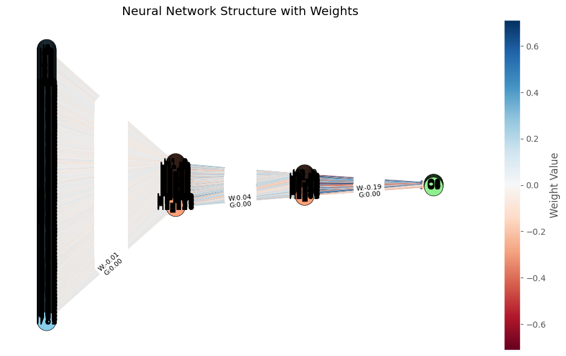
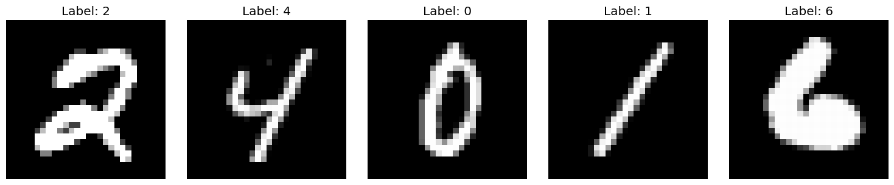

<h1 align="center">Tugas Besar 1 IF3270 Pembelajaran Mesin</h1>
<h2 align="center">Feedforward Neural Network 🧠</h2>

<h3 align="center">Neural Network Visualization</h3>
<div align="center">
  
</div>

<h3 align="center">MNIST_784 Datasets Visualization</h3>
<div align="center">
  
</div>

## ️🖥️ Deskripsi Umum
Repositori ini dibuat untuk memenuhi Tugas Besar I mata kuliah **IF3270 - Pembelajaran Mesin**, yang bertujuan untuk memberikan pemahaman mendalam tentang implementasi algoritma **Feedforward Neural Network (FFNN)** dari awal (from scratch). Dalam tugas ini, kami mengembangkan FFNN tanpa menggunakan pustaka pembelajaran mesin tingkat tinggi seperti TensorFlow atau PyTorch, guna memahami konsep fundamental dan mekanisme kerja Neural Network.

## 🏃‍♂️ How To Run The Program
1. Pastikan Anda telah menginstal numpy dan matplotlib, sklearn pada sistem Anda. Jika belum, Anda dapat menginstalnya menggunakan pip:
```bash
pip install numpy matplotlib scikit-learn
```

2. Akses folder `src` dan akses test_main.ipynb, lalu jalankan sel-sel yang fundamental untuk menjalankan program yakni sel :
```bash
1. Import libraries, 
2. fungsi load_mnist, 
3. visualize_examples, 
4. load dataset, 
5. fungsi train_and_evaluate, 
6. fungsi calculate_f1 :
7. fungsi plot_training_history_and_accuracy
8. fungsi visualize_predictions
```

3. Setelah itu, buatlah cell baru

4. Opsional: Ambil subset data untuk eksperimen lebih cepat, tambahkan ini pada cell baru:
```bash
subset_size = 15000 # Dapat diubah sesuai kebutuhan
X_train_subset = X_train[:subset_size]
y_train_subset = y_train[:subset_size]
```

5. Opsi 1. Melatih model dengan sederhana (Dimana semua layer hanya akan menggunakan 1 tipe weight initializer dan semua hidden layer hanya akan menggunakan 1 tipe fungsi aktivasi dengan semua parameter initializer dibuat default dan tidak menggunakan regularisasi apapun) tambahkan ini pada cell tersebut :
```bash
results = train_and_evaluate(
    X_train_subset, X_test, y_train_subset, y_test,
    hidden_layers=2,                  # Jumlah hidden layer
    width_per_layer=[128, 64],        # Jumlah neuron per layer
    loss ='categorical_crossentropy', # Fungsi loss
    hidden_activation='relu',         # Fungsi aktivasi default hidden layer
    output_activation='softmax',      # Fungsi aktivasi output layer
    weight_initializer='he',          # Metode inisialisasi default
    epochs=20,                        # Jumlah epoch
    learning_rate=0.01,               # Learning rate
    batch_size=128                    # Ukuran batch
    verbose=1,                        # opsi 1 untuk menampilkan hasil pelatihan, 0 untuk tidak
)
```

6. Opsi 2. Melatih model dengan kompleks (Dimana semua layer dapat menggunakan tipe weight initializernya masing-masing dan semua hidden layer dapat menggunakan tipe fungsi aktivasinya masing-masing) menambahkan ini pada cell tersebut :
```bash
results = train_and_evaluate(
    X_train_subset, X_test, y_train_subset, y_test,
    hidden_layers=3,                                        # Jumlah hidden layer
    width_per_layer=[256, 128, 64],                         # Jumlah neuron per layer
    loss='categorical_crossentropy',                        # Fungsi loss   
    layer_activations=['relu', 'leakyrelu', 'tanh'],        # Fungsi aktivasi per layer
    output_activation='softmax',                            # Fungsi aktivasi output layer
    
    # Inisialisasi berbeda per layer
    layer_initializers=['he', 'xavier', 'uniform'],         # Metode inisialisasi per layer
    layer_initializer_params=[
        {},                         # Parameter untuk he yang dapat dicustom
        {},                         # Parameter untuk xavier yang dapat dicustom
        {'low': -0.1, 'high': 0.1},  # Parameter untuk uniform yang dapat dicustom
    ],
    
    # Parameter regularisasi
    l1_reg=0.0001,                  # Regularisasi L1 yang dapat dicustom
    l2_reg=0.0001,                  # Regularisasi L2 yang dapat dicustom
    
    epochs=20,                      # Jumlah epoch
    learning_rate=0.01,             # Learning rate
    batch_size=64,                  # Ukuran batch
    verbose=1                       # opsi 1 untuk menampilkan hasil pelatihan, 0 untuk tidak
)
```

7. Setelah pelatihan selesai, bisa juga menghitung F1 score dengan menambahkan ini : 
```bash
y_pred = results['model'].forward(X_test)
results['f1_score'] = calculate_f1(y_test, y_pred)
print(f"F1 Score: {results['f1_score']:.4f}")
```

8. Bisa juga melakukan save model dengan menambahkan ini : 
```bash
model = results['model']
history = results['history']

model.save('models/{Nama file}.pkl')
```

9. Visualisasi dapat dilakukan dengan menambahkan ini : 
```bash
history = results['history']

# Plot history training dan akurasi
plot_training_history_and_accuracy(history, model, X_test, y_test)

# Visualisasi neural network
model.visualize_network(figsize=(10, 6))

# Visualisasi distribusi bobot
model.visualize_weight_distribution()

# Visualisasi distribusi gradient
model.visualize_gradient_distribution()

# Visualisasi prediksi
visualize_predictions(model, X_test, y_test, n_examples=10) #n_examples dapat dikonfigurasikan sesuai keinginan
```

10. Jika ingin meload model, maka buatlah cell baru dan tambahkan ini:
```bash
model = FFNN.load('models/{Nama file}.pkl')
```

## 🧑‍🏭Pembagian Pekerjaan
<table border="1">
  <thead>
    <tr>
      <th>NIM</th>
      <th>Nama</th>
      <th>Pekerjaan</th>
    </tr>
  </thead>
  <tbody>
    <tr>
      <td>13522124</td>
      <td>Aland Mulia Pratama</td>
      <td>Mengerjakan bonus Regularization L1 dan L2. Melakukan pengujian model pada .ipynb serta formatting jupiter notebook. Melakukan pengujian pengaruh Regularization L1 dan L2 pada jupiter notebook. Mengerjakan Deskripsi Persoalan, Pembahasan, Kesimpulan dan Saran pada laporan.</td>
    </tr>
    <tr>
      <td>13522135</td>
      <td>Christian Justin Hendrawan</td>
      <td>Mengimplementasikan fungsi-fungsi aktivasi yakni kelas Activation. Mengimplementasikan weight initializer yakni kelas Initializer. Mengimplementasikan kelas Layer. Mengimplementasikan fungsi loss yakni kelas Loss. Mengimplementasikan model FFNN yakni kelas FFNN. Mengimplementasikan fungsi untuk load dan train model. Melakukan pengujian model dengan hyperparameter width, depth, fungsi aktivasi, learning rate, dan inisialisasi bobot. Mengerjakan bagian pembahasan yakni Penjelasan Implementasi Feed Forward Neural Network.</td>
    </tr>
    <tr>
      <td>13522150</td>
      <td>Albert Ghazaly</td>
      <td>Mengerjakan spesifikasi bonus metode inisialisasi bobot yakni  Xavier Initialization dan He Initialization. Mengerjakan spesifikasi bonus fungsi aktivasi yakni Swish Activation dan Leaky ReLU Activation function. Mengerjakan hasil pengujian, penjelasan forward propagation, dan backward propagation pada laporan.</td>
    </tr>
  </tbody>
</table>